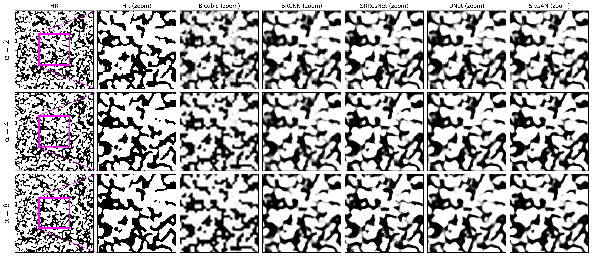
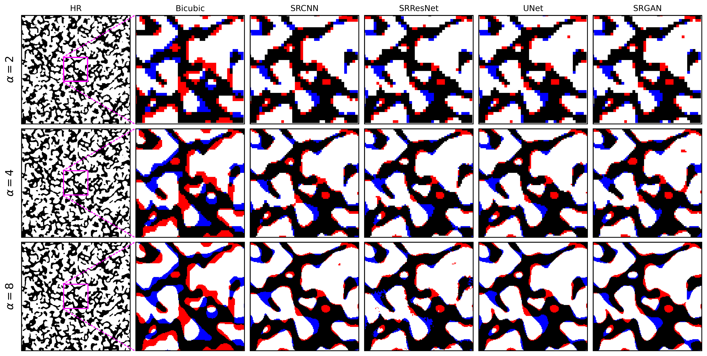

# 3D Microstructure Super-Resolution Models

This repository provides training and inference scripts for four 3D super-resolution models:

- SRCNN3D
- SRResNet3D
- SRGAN3D
- SRUNet3D

The models support scale factors **×2, ×4, and ×8**.

| Scale factor | LR input | HR target |
| --- | --- | --- |
| ×2 | 100 | 200 |
| ×4 | 100 | 400 |
| ×8 | 100 | 800 |

## Repository Content

The GitHub repository includes:

- training and inference scripts,
- pretrained **×2** model weights,
- testing TIFF volumes at resolutions `100` and `200`,
- example figures.

The current GitHub structure is:

```text
3D_SuperResolutionModels/
├── checkpoints/
│   ├── SRCNN3D/model_x2/
│   ├── SRResNet3D/model_x2/
│   ├── SRGAN3D/model_x2/
│   └── SRUNet3D/model_x2/
├── data/
│   └── Testing_Data/
│       ├── 100/
│       └── 200/
├── docs/figures/
├── Test_Models/
├── Train_Models/
├── requirements.txt
└── README.md
```

The complete dataset and pretrained checkpoints for **×2, ×4, and ×8** are available on Zenodo:

**Zenodo DOI:** `https://doi.org/10.5281/zenodo.23240235

After downloading the complete data and checkpoints from Zenodo, the project should have the following structure:

```text
3D_SuperResolutionModels/
├── checkpoints/
│   ├── SRCNN3D/
│   │   ├── model_x2/
│   │   ├── model_x4/
│   │   └── model_x8/
│   ├── SRResNet3D/
│   │   ├── model_x2/
│   │   ├── model_x4/
│   │   └── model_x8/
│   ├── SRGAN3D/
│   │   ├── model_x2/
│   │   ├── model_x4/
│   │   └── model_x8/
│   └── SRUNet3D/
│       ├── model_x2/
│       ├── model_x4/
│       └── model_x8/
│
├── data/
│   ├── Training_Data/
│   │   ├── 100/
│   │   ├── 200/
│   │   ├── 400/
│   │   └── 800/
│   ├── Testing_Data/
│   │   ├── 100/
│   │   ├── 200/
│   │   ├── 400/
│   │   └── 800/
│   └── SR_Data/
│
├── Test_Models/
├── Train_Models/
├── requirements.txt
└── README.md
```

## Installation

From the repository root:

```bash
python -m venv .venv
source .venv/bin/activate
pip install -r requirements.txt
```

The scripts use CUDA when available and otherwise run on CPU.

# Testing

## Test the Included ×2 Models

The GitHub repository already contains the required ×2 checkpoints and the LR test TIFF volumes in:

```text
data/Testing_Data/100/
```

### Step 1: Select the model

For example, to test SRResNet3D, open:

```text
Test_Models/srresnet_test.py
```

### Step 2: Set the scale factor

```python
upscale_factor = 2
```

### Step 3: Run inference

```bash
python Test_Models/srresnet_test.py
```

Other models can be tested using:

```bash
python Test_Models/srcnn_test.py
python Test_Models/srgan_test.py
python Test_Models/srunet_test.py
```

The generated SR TIFF volumes are saved under:

```text
data/SR_Data/<MODEL_NAME>/x2_outputs/
```

The corresponding HR reference volumes are available in:

```text
data/Testing_Data/200/
```

## Test ×4 or ×8 Models

For ×4 and ×8, download the corresponding pretrained checkpoints and test data from Zenodo.

Place the files in the matching directories, for example:

```text
checkpoints/SRResNet3D/model_x4/sr_model_x4.pth
checkpoints/SRResNet3D/model_x8/sr_model_x8.pth
```

and:

```text
data/Testing_Data/400/
data/Testing_Data/800/
```

Then set:

```python
upscale_factor = 4
```

or:

```python
upscale_factor = 8
```

and run the required test script.

# Training

To train a model from scratch, first download the complete dataset from Zenodo and place it under:

```text
data/Training_Data/
```

The expected training structure is:

```text
data/Training_Data/
├── 100/
├── 200/
├── 400/
└── 800/
```

The dataset is already organized by resolution, so no additional rearrangement is required.

## Step 1: Select the scale factor

Open the required training script and set:

```python
upscale_factor = 2
```

Use:

```text
2 → 100 to 200
4 → 100 to 400
8 → 100 to 800
```

## Step 2: Run training

For example, to train SRCNN3D:

```bash
python Train_Models/srcnn_train.py
```

Other models:

```bash
python Train_Models/srresnet_train.py
python Train_Models/srgan_train.py
python Train_Models/srunet_train.py
```

Training outputs are saved under:

```text
checkpoints/<MODEL_NAME>/model_x<factor>/
```

## Example Results





## Citation

If you use this repository, dataset, or pretrained models, please cite the associated publication and Zenodo record.

**Zenodo:**  
`https://doi.org/10.5281/zenodo.23240235

**Publication:**  
Citation to be added after publication.
